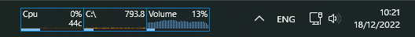

# Rainmeter Skins

Custom Rainmeter configuration skins.  
To use skins, the latest version of [Rainmeter][rainmeter-website] must be installed on the machine.

## Current Skins

### rs-samurize

[Samurize][samurize-wiki] inspired pixel perfect minimal skin which contains the necessary meters to monitor your system.  
The skin contains meters for the below components:

- CPU and Ram (CPU temperature reading, RAM current usage in percentage)  
  On Click: Open [Process Explorer][process-explorer] if installed in `C:\ProcessExplorer\procexp64.exe`
- Drives (free space, current read/write usage in percentage)  
  On Click: Open the relevant drive
- Network Up and Down in Kilobytes/Second  
  On Click: Open the network settings
- Volume meter display and live 39 band meters  
  On Click: Open Windows sound configuration

Below image contains the CPU, C Drive and the volume meters displayed over the Windows taskbar.

## Using the Skins

- Make sure the latest version of Rainmeter is installed on the machine
- Clone the repository
- Copy the desired skin folder to the `C:\Users\UseName\Documents\Rainmeter\Skins` folder
- Right click the Rainmeter icon in the task system tray and select "Manage Rainmeter"
- Navigate to the "Skins" tab and click the "Refresh All" button at the bottom left corner
- Select the desired `*.ini` files from the new skin folders to display the relevant skin element
- Drag the meter to the desired position on the desktop
- It is possible to set the "Position" property for the desired items to "Stay Topmost"
- Go to the "Layouts" tab and save the new layout with a desired name

## CPU Temperature Reading

CPU Temperature can be displayed with the help of the CoreTemp software.  
[CoreTemp][core-temp] should be running in the background.  
Documentation on how to use the CoreTemp Plugin in Rainmeter can be found [here][core-temp-plugin].  
The "CpuRam" meter now contains a temperature display along with the CPU usage percentage.

## References

- Rainmeter Skin Customization [documentation][skin-documentation]
- [CoreTemp Download][core-temp]

[core-temp]: https://www.alcpu.com/CoreTemp/
[core-temp-plugin]: https://docs.rainmeter.net/manual/plugins/coretemp/
[rainmeter-website]: https://www.rainmeter.net/
[skin-documentation]: https://docs.rainmeter.net/manual/skins/
[samurize-wiki]: https://en.wikipedia.org/wiki/Samurize
[process-explorer]: https://learn.microsoft.com/en-us/sysinternals/downloads/process-explorer
